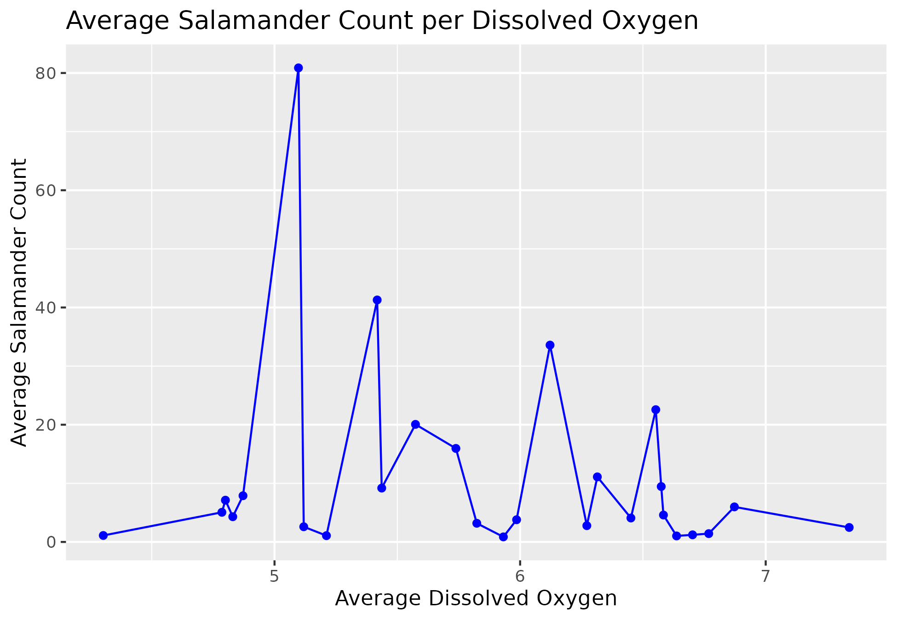
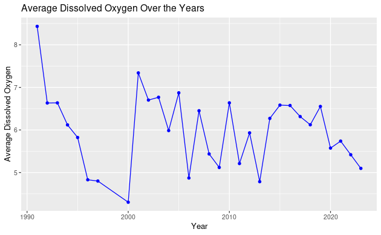

# Barton Springs Salamander Data Analysis Project

## Star this project! 

## Project Description
This data science project investigates the relationship between water quality parameters and the population sizes of Barton Springs Salamanders in Austin, Texas. Barton Springs Salamanders are a vulnerable species, and understanding how water quality affects their population is crucial for ecological preservation. This project utilizes a dataset obtained from the [Austin Open Data Portal](http://data.austintexas.gov) to conduct a comprehensive analysis.

## Goals
The primary goals of this project are as follows:
  1. Analyze the relationship between Dissolved Oxygen (DO) levels and the population of Barton Springs Salamanders.
2. Investigate the impact of flow rates on the salamander population.
3. Contribute to informed decision-making for ecological protection and restoration efforts in Barton Springs.

## Data Source
The dataset used for this analysis is titled "Barton Springs Salamanders - DO and Flow" and can be accessed through the [Austin Open Data Portal](https://data.austintexas.gov/Environment/Barton-Springs-Salamanders-DO-and-Flow/pyic-v8yf). The dataset contains approximately 40,000 data points with eight columns, including:
  - Watershed location
- Date and time of data collection
- Site name
- Longitude and latitude coordinates
- Site type (e.g., spring)
- Medium (e.g., groundwater, benthic)
- Parameter (e.g., dissolved oxygen, salamander size)

## Hypotheses
This project explores the following hypotheses:

  1. **Hypothesis 1:** Increased levels of Dissolved Oxygen (DO) in a Barton spring will lead to a larger population of salamanders.
- Null Hypothesis: There is no significant relationship between DO levels and salamander population size.
2. **Hypothesis 2:** Higher flow rates will result in a smaller population of salamanders.
- Null Hypothesis: There is no significant relationship between flow rates and salamander population size.

## Plots

## References
- [Austin Open Data Portal](http://data.austintexas.gov)
- Dataset Source: [Barton Springs Salamanders - DO and Flow](https://data.austintexas.gov/Environment/Barton-Springs-Salamanders-DO-and-Flow/pyic-v8yf)

## Modeling:

Some examples of regression we did are here:

## Ethics:

- **Project Focus:**
  - Preservation and conservation of a unique population of salamanders in Austin.
  - Research project with distinct ethical implications related to continuity, openness, and sustainability.

- **Ethical Considerations:**
  - Importance of exploring ethical consequences in nature, considering the impact on surrounding communities and the ecosystem.
  - Barton Spring salamanders identified as an 'at-risk' species, with data collected solely for preservation and conservation purposes.
  - Native 'Austinites' exhibit a sense of kinship, contributing to the salamander population's health and future conservation efforts.

- **Funding for Conservation:**
  - Average allocation of $40,000 for conservation, with proposal funds ranging from $10,000 to $80,000.
  - State-owned land of Barton Springs increases surrounding land values, leading to potential conflicts for long-term residents.

- **Public Opinion and Dialogue:**
  - Loyalty of Austin residents to salamanders sparks ethical discussions on maintaining open dialogue with the public.
  - Publicly accessible data on salamanders and conservation efforts, but accessibility challenges for laypeople.
  - Ethical implications of untidy data and methodology changes over time, emphasizing the need for clarity in communicating impact.

- **Dataset Concerns:**
  - Untidy dataset poses ethical concerns regarding the accuracy of observed data.
  - Changes in data collection methods may impact the determination of salamanders' at-risk status and funding needs.
  - Importance of having accurate data for proper allocation of funds and effective salamander protection.

- **Sustainability and Conservation:**
  - Project's ethical concerns center around ensuring accurate data analysis for the well-being of salamanders in their natural environment.
  - Emphasis on public involvement in contributing to and ensuring the longevity of conservation efforts.

## Support the Project

If you find this project helpful and would like to support its development, consider making a donation:

Your contributions help us maintain and improve this project. Thank you for your support!

