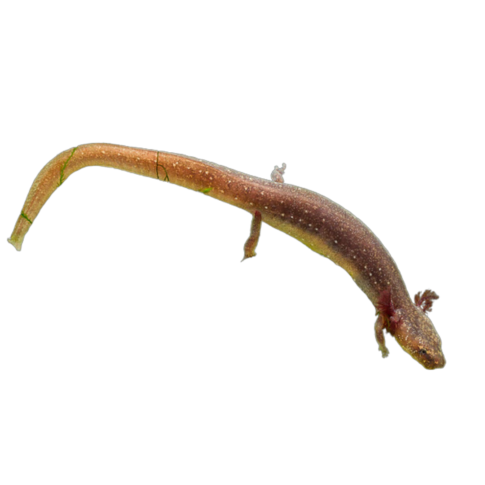
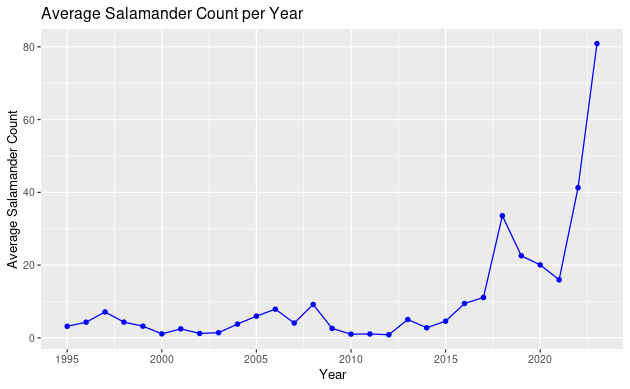

<html lang="en">
<head>
    <meta charset="UTF-8">
    <meta name="viewport" content="width=device-width, initial-scale=1.0">
    
    <title>Cursor Follow Image</title>
</head>
<body>
    

    
</body>
# Here is our data visualizations:

## Dissolved Oxygen Levels over Time

## Average Salamander Count Per Dissolved Oxygen Count

## Average Salamander Count Over Time

## Average Flow Type Vs Salamander Count

</html>
