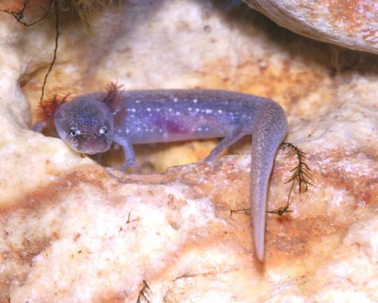

# Barton Springs Salamanders and their Habitat

{width=20%}

## Summary of Group 7's Project

Our data science project investigates the correlation between water quality parameters (dissolved oxygen levels and flow rates) and the population sizes of Barton Springs Salamanders in Austin, Texas. Utilizing the dataset "Barton Springs Salamanders DO and Flow" from [data.austintexas.gov](https://data.austintexas.gov/Environment/Barton-Springs-Salamanders-DO-and-Flow/pyic-v8yf), our analysis aims to reveal how water quality impacts the endangered species at various sampling points in Barton Springs. Understanding this relationship is crucial for preserving the species and the broader ecosystem. Our findings will inform decision-making for ecological protection and restoration efforts.

The initial hypothesis suggests a potential significant correlation between higher dissolved oxygen levels, lower flow rates, and increased salamander populations, emphasizing the vital role of these factors in the salamanders' habitat quality and well-being.

## Contents of this website:

- [Exploratory Analysis](/ExploratoryAnalysis)
- [Data Modeling](/DataModeling)
- [Discussion](/Discussion)
- [Ethics](/Ethics)
- [Conclusion](/Conclusion)
- [Acknowledgments](/Acknowledgments)
- [Bibliography](/Bibliography)

To see the original data, look [here](https://data.austintexas.gov/Environment/Barton-Springs-Salamanders-DO-and-Flow/pyic-v8yf).
